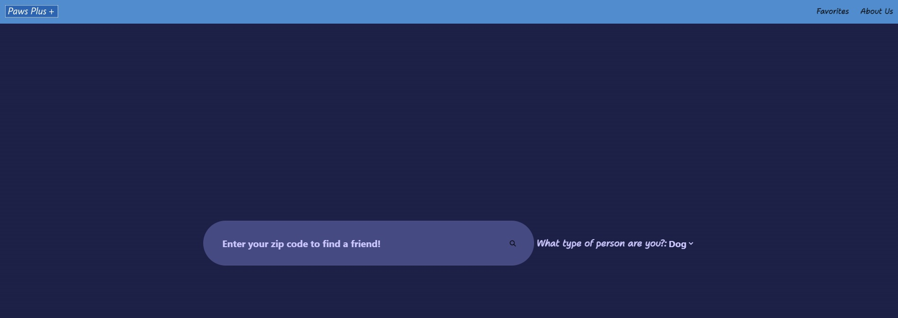
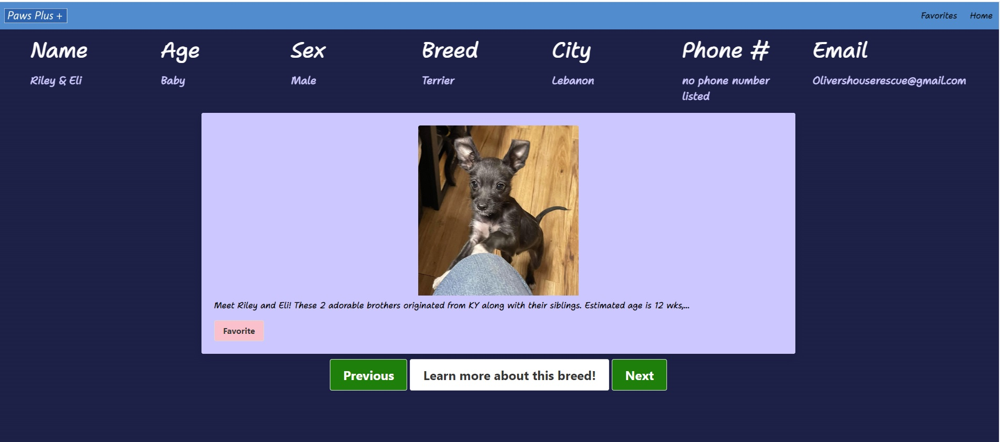
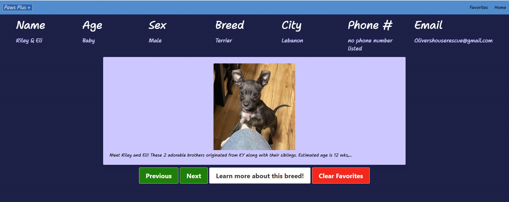

# PawsPlus+ PetFinder 

## Description

Created a pet finder application called PawsPlus+! With this application, persons seeking to adopt a pet are able to use PawsPlus+ to find dog and cat listings at animal shelters near them from the comfort of wherever they have internet access. Users are provided with some contact information to reach out about any pets they are interested in, as well as save their favorites for later viewing if they have yet to decide on their new pet. 

Published website:  https://molyneauxk93.github.io/PawsPlus-/

## Installation

N/A

## Usage

Use PwsPlus+ to help you find your new furry friend(s)! With just your zip code and preference between dogs or cats you can potentially find dozens of pet listings at the push up a button!

## Credits

Collaboration credits on PawsPlus+ to Isaac Stofko, Shane Davis, and Kevin Molyneaux for their development of PawsPlus+

## License

MIT License - Please refer to the LICENSE in the repo.

## Usage
The following image shows the first page of the PawsPlus+. This page is where the users enter their zip code and choose their desired pet type from the drop down to perform a search. 

The follwing image shows the favorites page which loads the results from the search on the home page. On this page users can navigate through a slide of pets that are available for adoption. There are various details about each pet provided to the user including a phone number and email if available for them to contact the shelter regarding any pets of interest. 

There is a Favorite button so that users can add any dogs/and or cats to their favorite for later viewing. You can also learn more about your pet of interest by clicking the 'Learn more about this breed' button which will open a wiki article in a new tab with information based on the listed animal breed. 

The following image shows the favorites page. On this page users are able to view all the pets they have saved as a favorite on the pet information page and also learn more about their pet here just as they are able to on the previous pet information page. Users are also able to clear their favorites.

